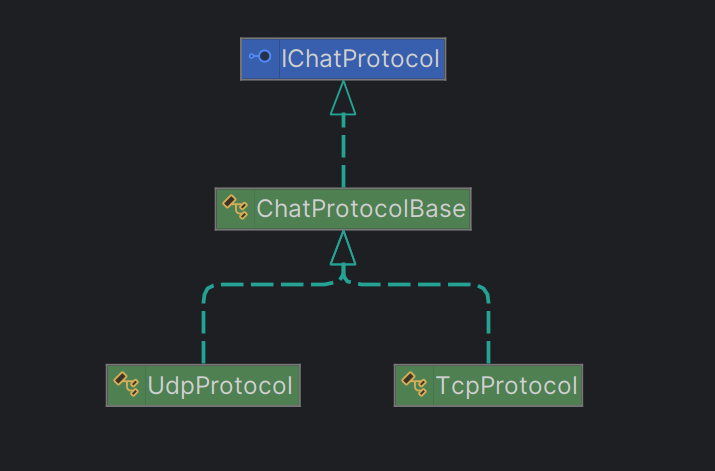

# IPK25 Chat Client

## Executive Summary: Chat Client Communication Theory

### Fundamental Concepts
The chat client operates as a network application that establishes connections to a remote server through either TCP or UDP.
The client implements a standardized communication flow where it first authenticates with user credentials, then joins specific chat channels, exchanges messages with other connected users, and finally performs a graceful disconnection when the session ends. 
All communication follows a defined protocol with specific message types and formats, with TCP using text-based messages and UDP employing binary packet structures with additional reliability mechanisms.

### TCP Message Format

The TCP protocol employs a text-based message format with predefined structures for each message type. All messages end with a carriage return and line feed (\r\n).

| Message Type | Message Parameter Template                     |
|--------------|-----------------------------------------------|
| ERR          | ERR FROM {DisplayName} IS {MessageContent}\r\n |
| REPLY        | REPLY {"OK"\|"NOK"} IS {MessageContent}\r\n    |
| AUTH         | AUTH {Username} AS {DisplayName} USING {Secret}\r\n |
| JOIN         | JOIN {ChannelID} AS {DisplayName}\r\n          |
| MSG          | MSG FROM {DisplayName} IS {MessageContent}\r\n |
| BYE          | BYE FROM {DisplayName}\r\n                     |

### UDP Message Format

The UDP protocol uses a binary message format with a fixed header structure. The first byte indicates the message type, followed by a 16-bit message ID, and the remaining bytes contain the message content.
In addition, the UDP protocol includes `CONFIRM` messages to ensure reliable delivery of messages and `PING` messages to check the connection status.
```text
╔════════╤═════════════════╤═══════---═══════╗
║  0..7  │  8..15   16..23 │      24..N      ║
╟────────┼────────┼────────┼─────────────────╢
║  Type  │        ID       │     Payload     ║
╚════════╧═════════════════╧═══════---═══════╝
```

Though UDP uses binary encoding and TCP uses text format, they represent identical operations.
In the implementation all incoming UDP messages are parsed from binary format and then converted to the same internal representation used for TCP messages

## Interesting Source Code Sections

### Protocol Implementation Details

Inheritance is used to provide a common interface and shared functionality for both TCP and UDP protocols. An abstract base class (e.g., ChatProtocolBase) defines the common methods and events. The TCP and UDP classes then inherit and override these methods to implement protocol-specific behaviors.



Example of a TCP protocol class inheriting from the base:
```csharp
public class TcpProtocol : ChatProtocolBase
{
    public override async Task SendAuthAsync(string username, string displayName, string secret)
    {
        // TCP-specific implementation of authentication
        await SendCommandAsync($"AUTH {username} AS {displayName} USING {secret}");
    }

    // Other overrides...
}
```

Example of a UDP protocol class inheriting from the base:
```csharp
public class UdpProtocol : ChatProtocolBase
{
    public override async Task SendAuthAsync(string username, string displayName, string secret)
    {
        // Create binary AUTH message and send over UDP with confirmation
        byte[] data = CreateBinaryMessage(0x02, username, displayName, secret);
        ushort msgId = BitConverter.ToUInt16(data, 1);
        await SendWithConfirmationAsync(data, msgId);
    }

    // Other overrides...
}
```

### Event-based Message Delivery

The common event is declared and raised in a base class so both protocol implementations can use it to deliver messages.

```csharp
public event EventHandler<MessageReceivedEventArgs> MessageReceived;

protected void OnMessageReceived(MessageType type, string content, string displayName)
{
    MessageReceived?.Invoke(this, new MessageReceivedEventArgs(type, content, displayName));
}
```

The ChatClient subscribes to the MessageReceived event from the protocol instance. This event is fired whenever a message is processed and forwarded by the protocol (TCP/UDP). The handling method in ChatClient receives the event arguments and then proceeds to process the content depending on the message type.

```csharp
public ChatClient(IChatProtocol protocol, bool verboseLogging = false)
        {
            _protocol = protocol;
            _protocol.MessageReceived += HandleMessageReceived;
            // Other initialization...
        }
        
private void HandleMessageReceived(object sender, MessageReceivedEventArgs e)
        {
            try
            {
                switch (e.Type)
                {
                    case MessageType.Reply:
                        // Reply message handling logic
                    case MessageType.Message:
                        // Error message handling logic
                        //...

```

## Usage

To run the chat client, execute the following command:

```csharp
./ipk25chat-client -t <tcp|udp> -s <host> [-p <port>] [-d <timeout>] [-r <retransmissions>] [-l] [-h]
```

Options:

-t                     Specifies the transport protocol (required). Choose either 'tcp' or 'udp'.

-s                     Specifies the server address (required).

-p                     Specifies the server port (default: 4567).

-d                     Sets the UDP confirmation timeout in milliseconds (default: 250).

-r                     Sets the maximum number of UDP retransmissions (default: 3).

-l                     Enables logging (outputs to stderr).

-h                     Displays help message.

## Testing

For testing purposes, a reference server anton5.fit.vutbr.cz was provided, which was used to verify the client's functionality when interacting with a remote host via both TCP and UDP protocols. The server implements all necessary functions for comprehensive testing of the chat client, including user authentication, channel management, and message exchange.

When showing output on the client side, the following color scheme is used:

<span style="color:#40e0ad">Turquoise</span>: Lines entered by the client (user commands)

<span style="color:#ffc0c0">Pink</span>: Interpreted messages received from the server

White: Messages from the client itself (hints, errors)

### Test Case 1: Chat Client launch using -h option

**What was tested:**
The functionality of the -h option for the Chat Client.

**Why it was tested:**
To ensure the application displays the help message when the help flag is used.

**Command:**
```bash
./ipk25chat-client -h
```

**Output:**

<pre style="background-color:#373839; padding:10px; border-radius:5px;">
Usage: ./ipk25chat-client -t &lt;tcp|udp&gt; -s &lt;host&gt; [-p &lt;port&gt;] [-d &lt;timeout&gt;] [-r &lt;retransmissions&gt;] [-l] [-h]
Options:
  -t &lt;tcp|udp&gt;     Transport protocol (required)
  -s &lt;host&gt;        Server address (required)
  -p &lt;port&gt;        Server port (default: 4567)
  -d &lt;timeout&gt;     UDP confirmation timeout in ms (default: 250)
  -r &lt;retransmissions&gt; Maximum number of UDP retransmissions (default: 3)
  -l              Enable logging (output to stderr)
  -h              Show this help message
</pre>

**Expected output:**

<pre style="background-color:#373839; padding:10px; border-radius:5px;">
Usage: ./ipk25chat-client -t &lt;tcp|udp&gt; -s &lt;host&gt; [-p &lt;port&gt;] [-d &lt;timeout&gt;] [-r &lt;retransmissions&gt;] [-l] [-h]
Options:
  -t &lt;tcp|udp&gt;     Transport protocol (required)
  -s &lt;host&gt;        Server address (required)
  -p &lt;port&gt;        Server port (default: 4567)
  -d &lt;timeout&gt;     UDP confirmation timeout in ms (default: 250)
  -r &lt;retransmissions&gt; Maximum number of UDP retransmissions (default: 3)
  -l              Enable logging (output to stderr)
  -h              Show this help message
</pre>

### Test Case 2: Normal launch of the Chat Client using TCP

**What was tested:**
Normal launch of the chat client using the TCP protocol.

**Why it was tested:**
To verify that the client successfully establishes a TCP connection, initializes streams, and properly handles the authentication process.

**Command:**
```bash
 ./ipk25chat-client -t tcp -s anton5.fit.vutbr.cz 
```

**Output:**

<pre style="background-color:#373839; padding:10px; border-radius:5px;">
<span style="color:#40e0ad">/auth xzhdan00 &lt;secret&gt; DisplayName</span>
<span style="color:#ffc0c0">Action Success: Authentication successful.</span>
<span style="color:#ffc0c0">Server: DisplayName has joined `discord.general` via TCP.</span>
</pre>


**Expected output:**

<pre style="background-color:#373839; padding:10px; border-radius:5px;">
<span style="color:#40e0ad">/auth xzhdan00 &lt;secret&gt; DisplayName</span>
<span style="color:#ffc0c0">Action Success: Authentication successful.</span>
<span style="color:#ffc0c0">Server: DisplayName has joined `discord.general` via TCP.</span>
</pre>


### Test Case 3: Normal launch of the Chat Client using UDP

**What was tested:**

The normal launch of the chat client using the UDP protocol.

**Why it was tested:**

To verify that the client successfully establishes a UDP connection, initializes streams, and properly handles the authentication process.

**Command:**

```bash
./ipk25chat-client -t udp -s anton5.fit.vutbr.cz
```

**Output:**

<pre style="background-color:#373839; padding:10px; border-radius:5px;">
<span style="color:#40e0ad">/auth xzhdan00 &lt;secret&gt; DisplayName</span>
<span style="color:#ffc0c0">Action Success: Authentication successful.</span>
<span style="color:#ffc0c0">Server: DisplayName has joined `discord.general` via UDP.</span>
</pre>

**Expected output:**

<pre style="background-color:#373839; padding:10px; border-radius:5px;">
<span style="color:#40e0ad">/auth xzhdan00 &lt;secret&gt; DisplayName</span>
<span style="color:#ffc0c0">Action Success: Authentication successful.</span>
<span style="color:#ffc0c0">Server: DisplayName has joined `discord.general` via UDP.</span>
</pre>

### Test Case 4: Joining a channel using TCP

**What was tested:**

The ability to join a channel using the TCP protocol.

**Why it was tested:**

To verify that the client can successfully join a channel and receive confirmation from the server.

**Command:**

```bash
./ipk25chat-client -t tcp -s anton5.fit.vutbr.cz
```

**Output:**

<pre style="background-color:#373839; padding:10px; border-radius:5px;">
<span style="color:#40e0ad">/auth xzhdan00 &lt;secret&gt; DisplayName</span>
<span style="color:#ffc0c0">Action Success: Authentication successful.</span>
<span style="color:#ffc0c0">Server: DisplayName has joined `discord.general` via TCP.</span>
<span style="color:#40e0ad">/join discord.test</span>
<span style="color:#ffc0c0">Action Success: Channel discord.test successfully joined. </span>
<span style="color:#ffc0c0">Server: DisplayName has switched from `discord.general` to `discord.test`. </span>
<span style="color:#ffc0c0">Server: DisplayName has joined `discord.test` via TCP. </span>
</pre>

**Expected output:**

<pre style="background-color:#373839; padding:10px; border-radius:5px;">
<span style="color:#40e0ad">/auth xzhdan00 &lt;secret&gt; DisplayName</span>
<span style="color:#ffc0c0">Action Success: Authentication successful.</span>
<span style="color:#ffc0c0">Server: DisplayName has joined `discord.general` via TCP.</span>
<span style="color:#40e0ad">/join discord.test</span>
<span style="color:#ffc0c0">Action Success: Channel discord.test successfully joined. </span>
<span style="color:#ffc0c0">Server: DisplayName has switched from `discord.general` to `discord.test`. </span>
<span style="color:#ffc0c0">Server: DisplayName has joined `discord.test` via TCP. </span>
</pre>

### Test Case 5: Joining a channel using UDP

**What was tested:**
The ability to join a channel using the UDP protocol.

**Why it was tested:**
To verify that the client can successfully join a channel and receive confirmation from the server.

**Command:**
```bash
./ipk25chat-client -t udp -s anton5.fit.vutbr.cz
```
**Output:**

<pre style="background-color:#373839; padding:10px; border-radius:5px;">
<span style="color:#40e0ad">/auth xzhdan00 &lt;secret&gt; DisplayName</span>
<span style="color:#ffc0c0">Action Success: Authentication successful.</span>
<span style="color:#ffc0c0">Server: DisplayName has joined `discord.general` via UDP.</span>
<span style="color:#40e0ad">/join discord.test</span>
<span style="color:#ffc0c0">Action Success: Channel discord.test successfully joined. </span>
<span style="color:#ffc0c0">Server: DisplayName has switched from `discord.general` to `discord.test`. </span>
<span style="color:#ffc0c0">Server: DisplayName has joined `discord.test` via UDP. </span>
</pre>

**Expected output:**

<pre style="background-color:#373839; padding:10px; border-radius:5px;">
<span style="color:#40e0ad">/auth xzhdan00 &lt;secret&gt; DisplayName</span>
<span style="color:#ffc0c0">Action Success: Authentication successful.</span>
<span style="color:#ffc0c0">Server: DisplayName has joined `discord.general` via UDP.</span>
<span style="color:#40e0ad">/join discord.test</span>
<span style="color:#ffc0c0">Action Success: Channel discord.test successfully joined. </span>
<span style="color:#ffc0c0">Server: DisplayName has switched from `discord.general` to `discord.test`. </span>
<span style="color:#ffc0c0">Server: DisplayName has joined `discord.test` via UDP. </span>
</pre>

### Test Case 6: Handling ERR message

**What was tested:**

The ability to handle an ERR message from the server.

**Why it was tested:**

To verify that the client can correctly interpret and respond to error messages from the server.

**Command:**
```bash
./ipk25chat-client -t tcp -s localhost 
```

**Output:**

<pre style="background-color:#373839; padding:10px; border-radius:5px;">
<span style="color:#ffc0c0">ERROR FROM Server: ERROR </span>
</pre>


**Expected output:**

<pre style="background-color:#373839; padding:10px; border-radius:5px;">
<span style="color:#ffc0c0">ERROR FROM Server: ERROR </span>
</pre>


### Test Case 7: Try to authenticate using an invalid secret

**What was tested:**
The ability to handle negative reply from the server 
when trying to authenticate using an invalid secret.

**Why it was tested:**
To verify that the client can correctly interpret and respond to negative reply messages from the server.

**Command:**
```bash
./ipk25chat-client -t udp -s anton5.fit.vutbr.cz
```

**Output:**

<pre style="background-color:#373839; padding:10px; border-radius:5px;">
<span style="color:#40e0ad">/auth xzhdan00 &lt;secret&gt; DisplayName</span>
<span style="color:#ffc0c0">Action Failure: Authentication failed - Provided user secret is not valid. </span>
</pre>


**Expected output:**

<pre style="background-color:#373839; padding:10px; border-radius:5px;">
<span style="color:#40e0ad">/auth xzhdan00 &lt;secret&gt; DisplayName</span>
<span style="color:#ffc0c0">Action Failure: Authentication failed - Provided user secret is not valid. </span>
</pre>

### Test Case 8: Graceful disconnection using TCP

**What was tested:**
The ability to gracefully disconnect from the server using the TCP protocol (e.g., sending the BYE message).

**Why it was tested:**
To verify that the client can successfully send a BYE message on interrupt signal or reaching the end of user input.


**Command:**
```bash
./ipk25chat-client -t tcp -s localhost
```

**Output (Client side):**

<pre style="background-color:#373839; padding:10px; border-radius:5px;">
<span style="color:#40e0ad">/auth xzhdan00 &lt;secret&gt; DisplayName</span>
<span style="color:#ffc0c0">Action Success: Auth Success.</span>
<span style="color:red">*** CTRL+C INREPPUPTION SIGNAL IS TRIGGERED ***</span>
</pre>

**Output (Server side):**

<pre style="background-color:#373839; padding:10px; border-radius:5px;">
AUTH xzhdan00 AS DisplayName USING &lt;secret&gt;
REPLY OK IS Auth Success.
BYE FROM DisplayName
</pre>


**Expected output (Server side):**

<pre style="background-color:#373839; padding:10px; border-radius:5px;">
AUTH xzhdan00 AS DisplayName USING &lt;secret&gt;
REPLY OK IS Auth Success.
BYE FROM DisplayName
</pre>

### Test Case 9: Try to use malformed command 

**What was tested:**
The ability to handle a malformed command.

**Why it was tested:**
To verify that the client can correctly interpret and respond to malformed commands.

**Command:**
```bash
./ipk25chat-client -t tcp -s localhost
```

**Output:**

<pre style="background-color:#373839; padding:10px; border-radius:5px;">
<span style="color:#40e0ad">/auth xzhdan00</span>
<span>Usage: /auth &lt;username&gt; &lt;secret&gt; &lt;displayname&gt;</span>
<span style="color:#40e0ad">/auth xzhdan00 &lt;secret&gt;</span>
<span>Usage: /auth &lt;username&gt; &lt;secret&gt; &lt;displayname&gt;</span>
<span style="color:#40e0ad">/auth xzhdan00 &lt;secret&gt; DisplayName</span>
<span style="color:#ffc0c0">Action Success: Auth Success.</span>
<span style="color:#40e0ad">/join</span>
<span>Usage: /join &lt;channel&gt;</span>
<span style="color:#40e0ad">/join !@#</span>
<span>Invalid channel ID</span>
<span style="color:#40e0ad">/some_malformed_command</span>
<span>Unknown command. Use /help for available commands</span>
</pre>


**Expected output:**

<pre style="background-color:#373839; padding:10px; border-radius:5px;">
<span style="color:#40e0ad">/auth xzhdan00</span>
<span>Usage: /auth &lt;username&gt; &lt;secret&gt; &lt;displayname&gt;</span>
<span style="color:#40e0ad">/auth xzhdan00 &lt;secret&gt;</span>
<span>Usage: /auth &lt;username&gt; &lt;secret&gt; &lt;displayname&gt;</span>
<span style="color:#40e0ad">/auth xzhdan00 &lt;secret&gt; DisplayName</span>
<span style="color:#ffc0c0">Action Success: Auth Success.</span>
<span style="color:#40e0ad">/join</span>
<span>Usage: /join &lt;channel&gt;</span>
<span style="color:#40e0ad">/join !@#</span>
<span>Invalid channel ID</span>
<span style="color:#40e0ad">/some_malformed_command</span>
<span>Unknown command. Use /help for available commands</span>
</pre>

### Test Case 10: Handling malformed incoming messages

**What was tested:**

The ability to handle malformed incoming messages.

**Why it was tested:**

To verify that the client can correctly interpret and respond to malformed incoming messages.

**Command:**
```bash
./ipk25chat-client -t tcp -s localhost
```

**Output (Client side):**

<pre style="background-color:#373839; padding:10px; border-radius:5px;">
<span style="color:#40e0ad">/auth xzhdan00 &lt;secret&gt; DisplayName</span>
<span style="color:#ffc0c0">Action Success: Auth Success.</span>
<span>ERROR: Unknown message format: 'THIS IS MALFORMED MESSAGE'</span>
</pre>

**Expected output (Client side):**

<pre style="background-color:#373839; padding:10px; border-radius:5px;">
<span style="color:#40e0ad">/auth xzhdan00 &lt;secret&gt; DisplayName</span>
<span style="color:#ffc0c0">Action Success: Auth Success.</span>
<span>ERROR: Unknown message format: 'THIS IS MALFORMED MESSAGE'</span>
</pre>

**Output (Server side):**

<pre style="background-color:#373839; padding:10px; border-radius:5px;">
AUTH xzhdan00 AS DisplayName USING &lt;secret&gt;
REPLY OK IS Auth success.
THIS IS MALFORMED MESSAGE
ERROR FROM DisplayName IS Unknown message format: 'THIS IS MALFORMED MESSAGE'
BYE FROM DisplayName
</pre>

**Expected output (Server side):**

<pre style="background-color:#373839; padding:10px; border-radius:5px;">
AUTH xzhdan00 AS DisplayName USING &lt;secret&gt;
REPLY OK IS Auth success.
THIS IS MALFORMED MESSAGE
ERROR FROM DisplayName IS Unknown message format: 'THIS IS MALFORMED MESSAGE'
BYE FROM DisplayName
</pre>

## Bibliography

- Stevens, W. R., Fenner, B., & Rudoff, A. M. (2003). *UNIX Network Programming: The Sockets Networking API*
- SharpPcap documentation: https://github.com/dotpcap/sharppcap
- RFC 793 - Transmission Control Protocol: https://tools.ietf.org/html/rfc793
- RFC 768 - User Datagram Protocol: https://tools.ietf.org/html/rfc768
  
Note: The project documentation was formatted with the assistance of Claude 3.7 Sonnet neural network. 